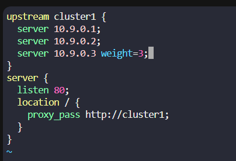

# Lab 02: High-Availability Nginx Load Balancer with Weighted Traffic Distribution

## 📋 The Mission
The objective was to scale an existing production Nginx load balancer to accommodate infrastructure expansion by integrating a new backend application server node (`10.9.0.3`). Due to differences in hardware capacity, the new server required custom traffic weights to optimize cluster resource utilization.

### Constraints & Requirements:
* **Zero Downtime:** The configuration must be updated without dropping live client connections.
* **Traffic Weighting:** The new node must capture a 3:1 ratio of inbound traffic compared to standard nodes.
* **Clean Isolation:** Default Nginx landing pages must be cleanly unlinked to prevent routing conflicts.

---

## 🛠️ My Solution
1. **Virtual Host De-confliction:** Inspected active site mappings and purged the standard `/etc/nginx/sites-enabled/default` link.
2. **Upstream Infrastructure Engineering:** Modified the active configuration to declare the new target node inside the upstream server pool using explicit weighting controls (`weight=3`).
3. **Automated Safety Gate:** Created a deployment wrapper (`deploy_lb.sh`) to automatically invoke the Nginx compiler validation check (`nginx -t`) prior to triggering a graceful system service configuration reload.

---

## 📂 Configuration & Scripts

### 1. Nginx Weighted Load Balancer Layout (`loadbalancer.conf`)


### 2. The Deployment Safety Automation Wrapper (`deploy_lb.sh`)
This script forces a pre-flight compiler syntax check. If any syntax error exists, it automatically aborts execution to guard the production environment from accidental downtime.

```bash
#!/bin/bash
if sudo nginx -t; then
    echo "Configuration syntax verified. Reloading Nginx..."
    sudo systemctl reload nginx
else
    echo "CRITICAL: Nginx syntax check failed! Aborting reload to prevent downtime." >&2
    exit 1
fi
