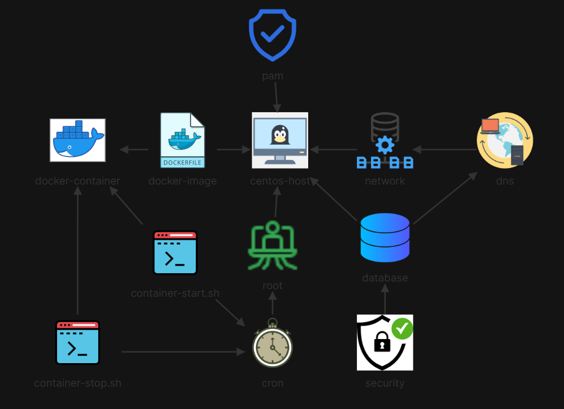

# 🚀 Automated Web & Database Provisioning with Scheduled Uptime

## 📖 Scenario Overview
The operations team required a single-node host server to run a secure MariaDB database backend and a containerized Nginx web frontend. To optimize resource allocation, the Nginx application lifecycle was automated to run strictly during business hours (8:00 AM to Midnight). This project demonstrates full-stack provisioning, including system security hardening via PAM, internal network configuration, database deployment, Docker containerization, and custom Bash automation.



## 🛠️ Implementation Procedure

### Step 1: System Security & Access Control (PAM)
Secure the system by restricting `su` access exclusively to the `wheel` administrative group, allowing for passwordless elevation for automation purposes.

```bash
# Unlock the root account
sudo passwd -u root

# Add the root user to the wheel group
sudo usermod -aG wheel root

# Verify group membership
sudo groupmems -g wheel -l

# Configure PAM to restrict 'su' and allow passwordless elevation for wheel members
sudo vi /etc/pam.d/su

# Uncomment the following lines in /etc/pam.d/su:
# auth           sufficient      pam_wheel.so trust use_uid
# auth           required        pam_wheel.so use_uid
```

### Step 2: Internal Networking & DNS Resolution
Provision a dedicated internal IP address for the database and configure local DNS resolution.

```bash
# Add a secondary IP to the eth0 interface
sudo ip addr add 10.0.0.50/24 dev eth0

# Verify the network interface configuration
ip -c -br a

# Add local DNS entry for the database hostname
echo "10.0.0.50 mydb.kodekloud.com" | sudo tee -a /etc/hosts
```

### Step 3: Backend Database Provisioning (MariaDB)
Install, enable, and secure the MariaDB service to ensure high availability and data security.

```bash
# Enable and start the MariaDB service simultaneously
sudo systemctl enable --now mariadb.service

# Verify service status
systemctl status mariadb.service

# Secure the database by setting a strong root password
sudo mysqladmin -u root password 'S3cure#321'

# Test database access
mysql -u root -p
```

### Step 4: Containerized Web Frontend (Docker & Nginx)
Deploy the application layer using a lightweight Docker container, mapping it directly to the host's web port.

```bash
# Pull the official Nginx image
sudo docker pull nginx

# Run the container in the background, mapping port 80
sudo docker run -d -p 80:80 --name myapp nginx:latest --restart on-failure

# Verify the container is running and port mapping is active
sudo docker ps -all
```

### Step 5: Automated Lifecycle Management (Bash & Cron)
Create custom Bash scripts to control the container lifecycle and schedule them via cron to enforce operational hours.

1. Create the Start Script (/home/bob/container-start.sh)

```bash
#!/bin/bash
CONTAINER="myapp"

if docker ps --format '{{.Names}}' | grep -qx "$CONTAINER"; then
    echo "$CONTAINER is already running."
    exit 0
fi

if docker start "$CONTAINER" >/dev/null; then
    echo "$CONTAINER container started!"
else
    echo "Failed to start container: $CONTAINER"
    exit 1
fi
```

2. Create the Stop Script (/home/bob/container-stop.sh)

```bash
#!/bin/bash
CONTAINER="myapp"

if ! docker ps --format '{{.Names}}' | grep -qx "$CONTAINER"; then
    echo "$CONTAINER is already stopped."
    exit 0
fi

if docker stop "$CONTAINER" >/dev/null; then
    echo "$CONTAINER container stopped!"
else
    echo "Failed to stop container: $CONTAINER"
    exit 1
fi
```

3. Make Scripts Executable & Schedule via Cron

```bash
# Apply execute permissions
chmod +x /home/bob/container-start.sh
chmod +x /home/bob/container-stop.sh

# Edit the root crontab
sudo crontab -e

# Add the following lines to schedule uptime from 8 AM to Midnight:
# 0 8 * * * /home/bob/container-start.sh
# 0 0 * * * /home/bob/container-stop.sh
```
