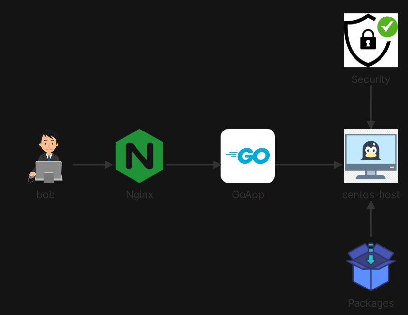
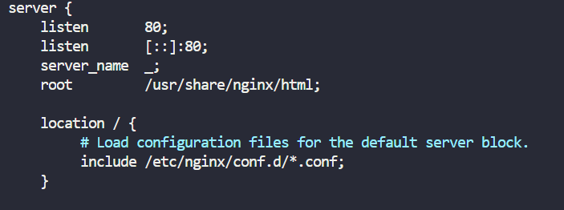

# 🚀 Nginx Reverse Proxy with Firewalld & Go Application

## 📖 Scenario Overview
The operations team deployed an internal Go application listening locally on port `8081` on `centos-host`. To make this application production-ready, the environment required network troubleshooting to restore broken package management (`yum`/`dnf`), installation and configuration of Nginx as an edge reverse proxy routing public HTTP traffic (port `80`) to the backend, and strict host-level packet filtering using `firewalld`.



## 🛠️ Implementation Procedure

### Step 1: Package Management & DNS Resolution Repair
Troubleshoot repo metadata errors caused by broken internal DNS resolution by configuring standard upstream resolvers.

```bash
# Verify DNS failure
curl -I [https://google.com](https://google.com)

# Append a public DNS server to /etc/resolv.conf
echo "nameserver 8.8.8.8" | sudo tee -a /etc/resolv.conf

# Test network resolution and package manager access
curl -I [https://google.com](https://google.com)
sudo dnf install nginx firewalld -y
```

### Step 2: Host Security Hardening (Firewalld)
Enable host-level firewall protection and configure explicit rules to allow administrative SSH (22), public HTTP (80), and direct backend access (8081).

```bash
# Enable and start firewalld
sudo systemctl enable --now firewalld

# Apply permanent port allowance rules
sudo firewall-cmd --zone=public --add-port=22/tcp --permanent
sudo firewall-cmd --zone=public --add-port=80/tcp --permanent
sudo firewall-cmd --zone=public --add-port=8081/tcp --permanent

# Reload firewall to enforce changes immediately
sudo firewall-cmd --reload

# Verify active rules
sudo firewall-cmd --zone=public --list-all
```

### Step 3: Nginx Reverse Proxy Configuration
Configure Nginx to proxy incoming client connections on port 80 directly to the Go service running locally on port 8081.

```bash
# Create the proxy configuration block
echo "proxy_pass http://127.0.0.1:8081;" | sudo tee /etc/nginx/conf.d/proxy.conf

# Configure the Reverse Proxy
# Open the main Nginx configuration file
sudo nano /etc/nginx/nginx.conf
```

Scroll down to the default `server { ... }` block that listens on port **80** and update it as shown below.



```bash
# Test the Nginx Configuration Syntax
sudo nginx -t
# We see a message stating syntax is ok and test is successful

# Enable and start Nginx service
sudo systemctl enable --now nginx

# Verify service status
systemctl status nginx
```

### Step 4: Backend Go Application Launch
Execute the Go application binary in the background using nohup to ensure persistence across shell sessions.

```bash
# Navigate to application directory
cd /home/bob/go-app/

# Launch the Go server in background mode
nohup go run main.go &
```

### Step 5: End-to-End Authentication Verification
Access the Go application through the Nginx reverse proxy on standard port 80 and log in using administrative credentials (test / test).
