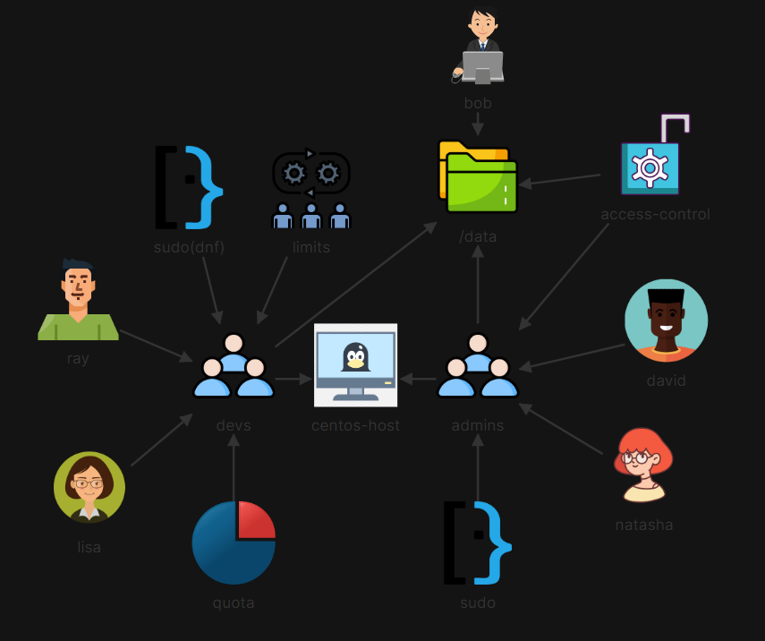

# 🚀 Linux Multi-Tenant RBAC, POSIX ACLs, Sudoers Delegation & Storage Quotas

## 📖 Scenario Overview
To support onboarding for new engineering teams on `centos-host`, the administration team established strict identity isolation, storage access rights, administrative privilege separation, process execution boundaries, and storage quota management across `admins` and `devs` user groups.



## 🛠️ Implementation & Verification Sequence

### Step 1: Directory Ownership & POSIX ACL Configuration
Configured `/data` directory ownership to `bob:devs` with standard `770` permissions, disabling access for `others`. Added an explicit POSIX ACL granting full `rwx` permissions to the `admins` group.

```bash
# Create target groups
sudo groupadd devs
sudo groupadd admins

# Set base ownership and permissions on /data
sudo chown bob:devs /data/
sudo chmod 770 /data/

# Apply POSIX Access Control List for admins group
sudo setfacl -m g:admins:rwx /data/

# Verify permissions and ACL rules
sudo getfacl /data/
```

### Step 2: Administrative User Provisioning (admins)
Provisioned users david and natasha with login shell /bin/zsh, assigned them secondary membership in the admins group, and set encrypted credentials.

```bash
# Provision user david
sudo useradd -m -s /bin/zsh david
echo "david:D3vUd3raaw" | sudo chpasswd
sudo usermod -aG admins david

# Provision user natasha
sudo useradd -m -s /bin/zsh natasha
echo "natasha:DwfawUd113" | sudo chpasswd
sudo usermod -aG admins natasha

# Verify shells and group assignments
getent passwd david natasha
sudo groupmems -g admins -l
```

### Step 3: Granular Sudoers Delegation
Configured role-based sudo permissions allowing admins full passwordless root execution, while restricting devs exclusively to /usr/bin/dnf.

```bash
# Edit sudoers configuration
sudo visudo

# Added privilege specifications:
%admins ALL=(ALL) NOPASSWD: ALL
%devs ALL=(ALL) NOPASSWD: /usr/bin/dnf
```

### Step 4: Developer User Provisioning (devs)
Provisioned users ray and lisa with login shell /bin/sh, assigned them to the devs group, and verified their login environments.

```bash
# Provision user ray
sudo useradd -m -s /bin/sh ray
echo "ray:D3vU3r321" | sudo chpasswd
sudo usermod -aG devs ray

# Provision user lisa
sudo useradd -m -s /bin/sh lisa
echo "lisa:D3vUd3r123" | sudo chpasswd
sudo usermod -aG devs lisa

# Confirm group membership
sudo groupmems -g devs -l
```

### Step 5: PAM Resource Limits & Group Storage Quotas
Enforced process limits on the devs group via PAM (limits.conf) to prevent fork bombs and configured disk storage quotas on the /data mount point (/dev/vdd1).

```bash
# Apply single-line combined soft/hard process limit (max 30 processes)
echo "@devs - nproc 30" | sudo tee -a /etc/security/limits.conf

# Set 100MB soft (102400 KB) and 500MB hard (512000 KB) block quotas on /data
sudo setquota -g devs 102400 512000 0 0 /data

# Report active filesystem quotas
sudo repquota -g /data
```