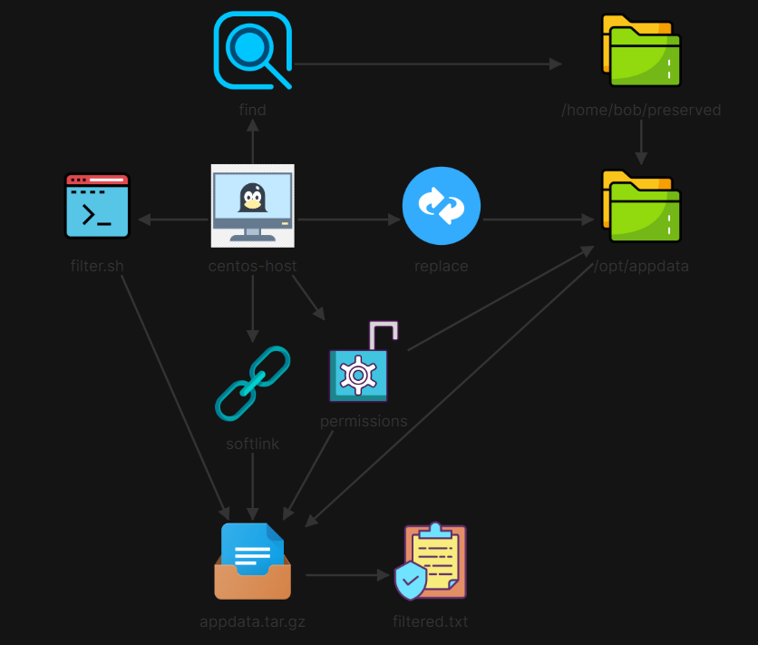

# 🚀 Automated Data Processing, Text Sanitization, Archiving & Shell Filtering

## 📖 Scenario Overview
Legacy application workflows on `centos-host` generate raw data files stored in `/home/bob/preserved`. The objective was to design a data processing pipeline that segregates hidden and non-hidden files into `/opt/appdata/`, sanitizes dataset contents (deleting targeted word patterns and performing global case-insensitive string replacements), secures the staging directory with special sticky bit permissions, generates an encrypted/restricted `tar.gz` archive with strict POSIX permissions, creates a system symlink, and automates archive data extraction using a custom shell script.



---

## 🛠️ Execution & Verification Steps

### Step 1: Staging Directory Creation & File Segregation
Created the target staging directory hierarchy under `/opt/appdata` and segregated hidden (`.*`) and non-hidden regular files from `/home/bob/preserved` without modifying original source data.

```bash
# Create destination directories
sudo mkdir -p /opt/appdata/hidden/ /opt/appdata/files/

# Segregate hidden regular files
sudo find /home/bob/preserved/ -type f -name ".*" -exec cp {} /opt/appdata/hidden/ \;

# Segregate non-hidden regular files
sudo find /home/bob/preserved/ -type f ! -name ".*" -exec cp {} /opt/appdata/files/ \;
```

### Step 2: Pattern-Based File Cleanup & Text Sanitization
Identified and purged any files containing words ending in lowercase "t", then executed global string replacements (yes $\rightarrow$ no and case-insensitive raw $\rightarrow$ processed).

```bash
# Delete files containing words ending with 't'
sudo find /opt/appdata/ -type f -exec grep -lq '[a-zA-Z]*t\b' {} \; -delete

# Verify deletion (returns empty output)
sudo find /opt/appdata/ -type f -exec grep -lnw '[a-zA-Z]*t\b' {} +

# Global case-insensitive replacement: 'raw' -> 'processed'
sudo find /opt/appdata/ -type f -exec sed -i 's/raw/processed/gI' {} +

# Global replacement: 'yes' -> 'no'
sudo find /opt/appdata/ -type f -exec sed -i 's/yes/no/g' {} +
```

### Step 3: Special Permissions, Compression & Symlink Creation
Applied a sticky bit to /opt/appdata/, compressed the processed directory into /opt/appdata.tar.gz, enforced strict read-only access for user/group bob, and generated a home directory softlink.

```bash
# Apply sticky bit (+t) to staging directory
sudo chmod +t /opt/appdata

# Create gzip tarball archive
sudo tar czf /opt/appdata.tar.gz /opt/appdata/

# Set owner/group to bob and enforce 440 (r--r-----) permissions
sudo chown bob:bob /opt/appdata.tar.gz
sudo chmod 440 /opt/appdata.tar.gz

# Create symbolic link in home directory
sudo ln -s /opt/appdata.tar.gz /home/bob/appdata.tar.gz

# Verify sticky bit, file ownership, mode, and softlink
ls -ld /opt/appdata
ls -la /opt/
ls -la /home/bob/appdata.tar.gz
```

### Step 4: Automated Shell Filter Script (filter.sh)
Developed /home/bob/filter.sh to extract and stream archived lines containing the string "processed" directly into /home/bob/filtered.txt without extracting the tarball to disk.

```bash
# Create filter script
cat << 'EOF' > /home/bob/filter.sh
#!/bin/bash
sudo tar -xzOf /opt/appdata.tar.gz | grep "processed" > /home/bob/filtered.txt
EOF

# Make executable and execute script
chmod +x /home/bob/filter.sh
./filter.sh

# Verify output generation
cat /home/bob/filtered.txt | head -n 10
```